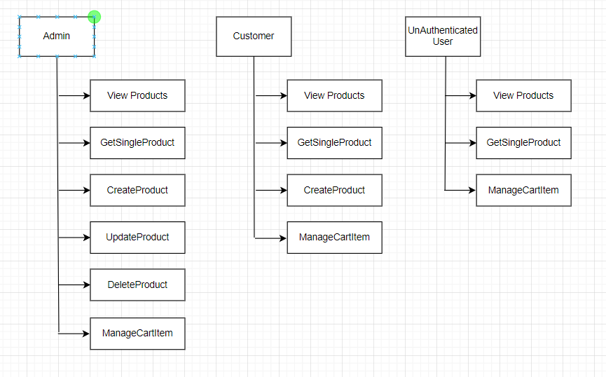
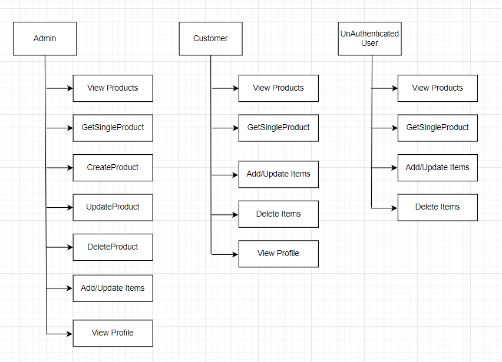

# Introduction

It is an Ecommerce application that manages products, users and cart items. This application uses [https://fakeapi.platzi.com/](https://fakeapi.platzi.com/) as endpoint. It is deployed in netlify.[Deployment Link](https://bucolic-semifreddo-2378d4.netlify.app/)

## Getting Started

To start the project first clone the project from the repository and run the node commands.

1. git clone https://github.com/sunilkarki2018/fs16_6-frontend-project.git
2. cd fs16_6-frontend-project
3. git checkout develop
4. npm install
5. npm start

## Role

## Usage

This application has 3 different modules. Below diagram shows all the methods supported by each modules.

The application has 2 roles and the access level of each role you can find in the image below.

## Architecture & Design

## Folder Structure

- `public/`
  - `index.html`

- `src/`

  - `components/`: All reusable React components are organized here.
   - `cart`: The main header component.
   - `category`: A sub-component for the logo.
   - `errors`: A sub-component for navigation links.
   - `products`: All reusable React components are organized here.
   - `users`: A sub-component for navigation links.
  - `hooks/`: All reusable React components are organized here.
  - `images/`: All reusable React components are organized here.
  - `layouts/`: All reusable React components are organized here.
  - `pages/`: All reusable React components are organized here.
  - `redux/`: All reusable React components are organized here.
  - `router/`: A component directory for the header section.
  - `tests/`: All reusable React components are organized here.
  - `types/`: All reusable React components are organized here.
  - `utils/`: All reusable React components are organized here.

     

This project requires implementation of TypeScript and SASS.

## Requirement

1. Use the API endpoint [https://fakeapi.platzi.com/](https://fakeapi.platzi.com/) to create an e-commerce website. Read the documentation and learn how to use the different endpoints.
2. Create at lease 4 pages (can be more if you want): Page for all products, product page,
   profile page (only available if user logins), and cart page (cart page could be a page or a modal)
3. Create Redux store for following features:
   - product reducer: get all products, find a single products, filter products by
     categories, sort products by price. Create, update and delete a product (enable update & delete features only for admin of the webapp)
   - user reducer: register and login
   - cart reducer: add product to cart, remove products, update products's quantity in cart
4. When adding routers to your application, programatically set certain routes to be private. For example, route to user profile page should not be accessible if user has not logged in.
5. Implement unit testing for the reducers
6. Deploy the application and rewrite README file.

## Bonus

1. Use context API to switch theme
2. Use pagination when fetching/displaying all the products
3. Implement performance optimization where applicable

## Instruction to start the project

In the project directory, you can run:

### `npm install`

Install all the dependencies

### `npm start`

Runs the app in the development mode.\
Open [http://localhost:3000](http://localhost:3000) to view it in the browser.

The page will reload if you make edits.\
You will also see any lint errors in the console.

### `npm test`

Launches the test runner in the interactive watch mode

### `npm run build`

Builds the app for production to the `build` folder.\
It correctly bundles React in production mode and optimizes the build for the best performance.
