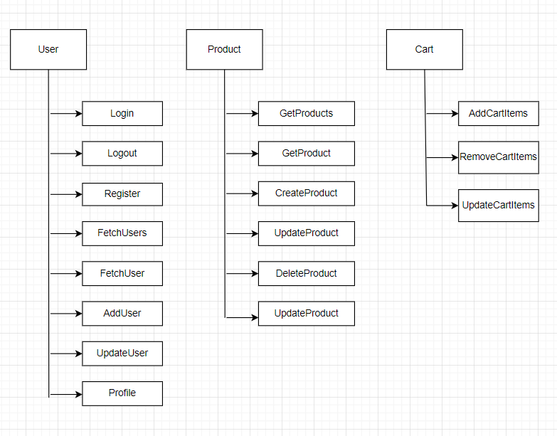

# Introduction

It is an Ecommerce application designed as a frontend task at Integrify. This application uses [link](https://ecommerce2024v1.azurewebsites.net/swagger/index.html) as endpoint. It is deployed in netlify.[Deployment Link](https://bucolic-semifreddo-2378d4.netlify.app/)

## Getting Started

To start the project first clone the project from the repository and run the node commands.

1. git clone https://github.com/sunilkarki2018/EcommerceApp.git
2. cd fs16_6-frontend-project
3. git checkout develop
4. npm install
5. npm start

## Technologies

- Typescript
- React
- Redux (Toolkit)
- React Router
- Material UI

## Usage
The project includes following scripts in package.json:

npm start: start application in local environment
npm build: builds application
npm test: run all test cases.

Features

1. Create, add, edit and delete Products.
2. Create, update users.
3. Add, update and manage cart items.
4. Search products based on search word and category. 
5. Sorting based on product price.
6. Pagination
7. Manage roles
8. User friendly Error display and Access Denied for unauthorized routing.

## Architecture & Design

This application can be mainly divided into 3 modules. Below diagram shows all the functionalities supported by each modules.

The application has 2 roles and the access level of each role you can find in the image below.

## Project Structure

- public
  - index.html
- src
  - apis
    - urls.ts
  - components
    - cart
      - AddressForm.tsx
      - CartList.tsx
      - CartSummary.tsx
      - Checkout.tsx
      - PaymentForm.tsx
      - Review.tsx
    - category
      - CategorySearch.tsx
    - errors
      - AccessDenied.tsx
      - ErrorMessage.tsx
      - NotFound.tsx
    - products
      - CreateProductForm.tsx
      - EditProductForm.tsx
      - ProductCard.tsx
      - ProductCardList.tsx
      - ProductSearch.tsx
      - ProductSort.tsx
      - ProductTableList.tsx
      - ProductView.tsx
    - users
      - CreateUserForm.tsx
      - EditUserForm.tsx
      - Login.tsx
      - Register.tsx
      - UserList.tsx
  - hooks
    - useAppDispatch.ts
    - useAppSelector.ts
    - useDebounce.ts
  - layout
    - App.tsx
    - Header.tsx
    - LoginMenu.tsx
  - pages
    - ContactPage.tsx
    - HomePage.tsx
    - ProfilePage.tsx
    - UserPage.tsx
  - redux
    - reducers
      - cartReducer.ts
      - categoryReducer.ts
      - productReducer.ts
      - userReducer.ts
    - store.ts
  - router
    - Routes.tsx
  - tests
    - data
    - shared
      - productServer.ts
      - userServer.ts
    - cartReducer.ts
    - fakeStore.ts
    - productReducer.test.ts
    - userReducer.test.ts
  - types
    - Cart
    - Category
    - Product
    - User
  - utils
    - common.ts
    - getFilteredAndSort.ts
    - upLoad.ts
  - index.tsx 
- .gitignore
- package.json
- README.md
- tsconfig.json

## Testing

The project uses JEST framework to unit test all the reducers.

To run test: npm test
